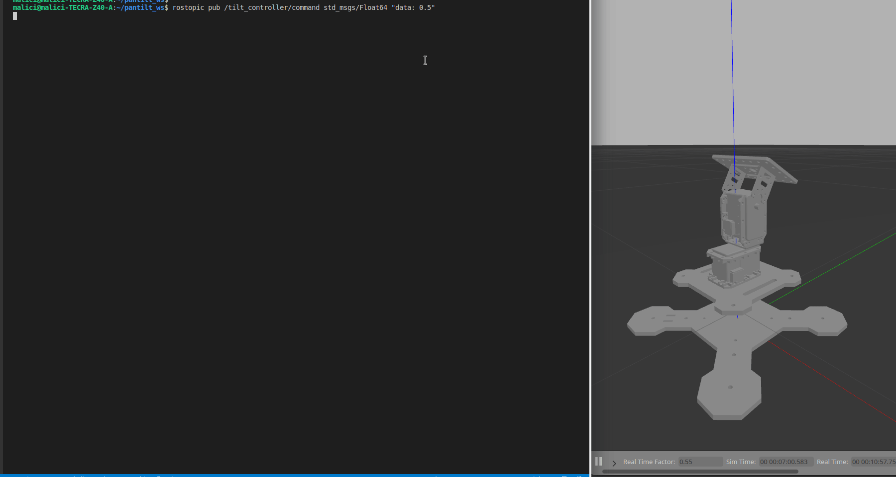

# Widowx Turret on Gazebo 
A tutorial to bring-up Pan-Tilt Turret on ROS Melodic and Gazebo.

## Getting Started

### Prerequisites
1. Ros Melodic Desktop Full

    Install following instructions on http://wiki.ros.org/melodic/Installation.
2. ROS Package Dependencies.

    Install it via,
    ```
    sudo apt-get install ros-melodic-arbotix-python
    ```

### Installation
1. Clone the repository,
    ```
    mkdir -p ~/pantilt_ws/src
    cd ~/pantilt_ws/src
    git clone https://github.com/mehmetalici/Widowx-Turret-gazebo.git
    ```
2. Build packages with `catkin_make` and source the workspace by,
    ```
    cd ..  # cd to workspace root dir.
    catkin_make
    source devel/setup.bash
    ```

### Simulate the Robot
```
roslaunch widowx_turret_gazebo widowx_turret_empty_world.launch
```

### Command the Joints
```
rostopic pub /pan_controller/command std_msgs/Float64 "data: -0.5" 
rostopic pub /tilt_controller/command std_msgs/Float64 "data: 0.5" 
```
